```python
from datetime import datetime
print("last update : ", datetime.today().strftime("%Y-%m-%d %H:%M"))
```

    last update :  2021-06-27 23:33


# Seaborn
### <U>dataset1. tips</U>
### load_dataset 


```python
import seaborn as sns
import matplotlib.pyplot as plt
```


```python
tips = sns.load_dataset("tips")
tips # size : 식사 인원
```


<div>
<style scoped>
    .dataframe tbody tr th:only-of-type {
        vertical-align: middle;
    }

    .dataframe tbody tr th {
        vertical-align: top;
    }

    .dataframe thead th {
        text-align: right;
    }
</style>
<table border="1" class="dataframe">
  <thead>
    <tr style="text-align: right;">
      <th></th>
      <th>total_bill</th>
      <th>tip</th>
      <th>sex</th>
      <th>smoker</th>
      <th>day</th>
      <th>time</th>
      <th>size</th>
    </tr>
  </thead>
  <tbody>
    <tr>
      <th>0</th>
      <td>16.99</td>
      <td>1.01</td>
      <td>Female</td>
      <td>No</td>
      <td>Sun</td>
      <td>Dinner</td>
      <td>2</td>
    </tr>
    <tr>
      <th>1</th>
      <td>10.34</td>
      <td>1.66</td>
      <td>Male</td>
      <td>No</td>
      <td>Sun</td>
      <td>Dinner</td>
      <td>3</td>
    </tr>
    <tr>
      <th>2</th>
      <td>21.01</td>
      <td>3.50</td>
      <td>Male</td>
      <td>No</td>
      <td>Sun</td>
      <td>Dinner</td>
      <td>3</td>
    </tr>
    <tr>
      <th>3</th>
      <td>23.68</td>
      <td>3.31</td>
      <td>Male</td>
      <td>No</td>
      <td>Sun</td>
      <td>Dinner</td>
      <td>2</td>
    </tr>
    <tr>
      <th>4</th>
      <td>24.59</td>
      <td>3.61</td>
      <td>Female</td>
      <td>No</td>
      <td>Sun</td>
      <td>Dinner</td>
      <td>4</td>
    </tr>
    <tr>
      <th>...</th>
      <td>...</td>
      <td>...</td>
      <td>...</td>
      <td>...</td>
      <td>...</td>
      <td>...</td>
      <td>...</td>
    </tr>
    <tr>
      <th>239</th>
      <td>29.03</td>
      <td>5.92</td>
      <td>Male</td>
      <td>No</td>
      <td>Sat</td>
      <td>Dinner</td>
      <td>3</td>
    </tr>
    <tr>
      <th>240</th>
      <td>27.18</td>
      <td>2.00</td>
      <td>Female</td>
      <td>Yes</td>
      <td>Sat</td>
      <td>Dinner</td>
      <td>2</td>
    </tr>
    <tr>
      <th>241</th>
      <td>22.67</td>
      <td>2.00</td>
      <td>Male</td>
      <td>Yes</td>
      <td>Sat</td>
      <td>Dinner</td>
      <td>2</td>
    </tr>
    <tr>
      <th>242</th>
      <td>17.82</td>
      <td>1.75</td>
      <td>Male</td>
      <td>No</td>
      <td>Sat</td>
      <td>Dinner</td>
      <td>2</td>
    </tr>
    <tr>
      <th>243</th>
      <td>18.78</td>
      <td>3.00</td>
      <td>Female</td>
      <td>No</td>
      <td>Thur</td>
      <td>Dinner</td>
      <td>2</td>
    </tr>
  </tbody>
</table>
<p>244 rows × 7 columns</p>
</div>


#### 수업 복습
### lmplot : 산점도 + 회귀직선


```python
sns.set_style("darkgrid") # whitegrid
sns.lmplot(x='total_bill',y='tip',data=tips, height=7) # height = size = figsize

```


    <seaborn.axisgrid.FacetGrid at 0x7fbbd008e520>


    
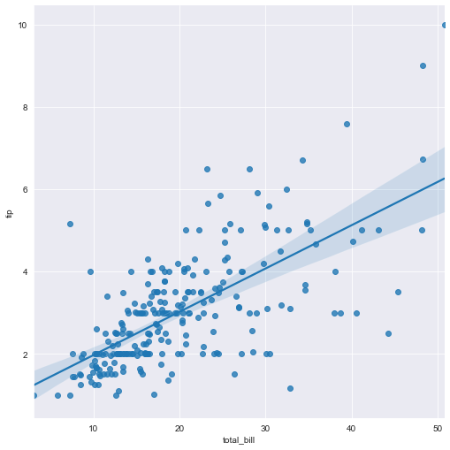
    


```python
sns.set_style("darkgrid")
# sns.lmplot(x='total_bill',y='tip',hue='smoker', data=tips, height=7)
sns.lmplot(x='total_bill',y='tip',hue='sex', data=tips, height=7)

```


    <seaborn.axisgrid.FacetGrid at 0x7fbc1063bac0>


    
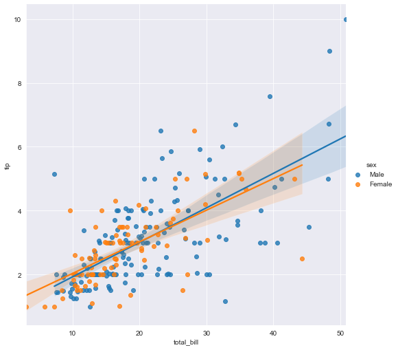
    


#### 추가 공부
### relplot : only 산점도, 데이터의 값이 모두 numeric일 때
style 인수를 통해 모양을 다르게 해줄 수도 있고, size 인수를 통해 크기를 다르게 해줄 수도 있다.


```python
# 인자 3개 = total_bill, tip, smoker/sex
# sns.relplot(x='total_bill',y='tip', hue='smoker', data=tips)
# sns.relplot(x='total_bill',y='tip', hue='sex', data=tips)

# 인자 3개 = total_bill, tip, smoker
sns.relplot(x='total_bill',y='tip', hue='smoker', style='smoker', data=tips)

```


    <seaborn.axisgrid.FacetGrid at 0x7fbc00c75130>


    
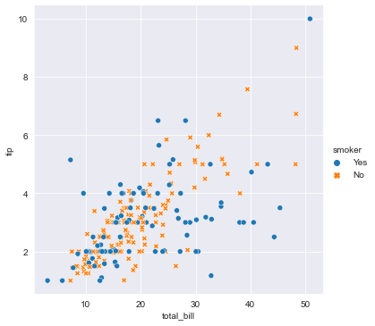
    


```python
# 인자 4개 = total_bill, tip, size(색으로 구별-hue 인자), smoker(사이즈로 구별-size 인자)
sns.relplot(x='total_bill',y='tip', hue='size', size='smoker', data=tips)

```


    <seaborn.axisgrid.FacetGrid at 0x7fbc21b84910>


    
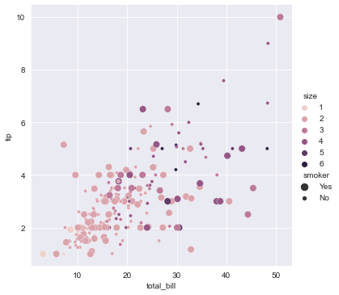
    


```python
sns.relplot(x='total_bill',y='tip', size='size', sizes=(15,200), data=tips)

```


    <seaborn.axisgrid.FacetGrid at 0x7fbc21db9790>


    
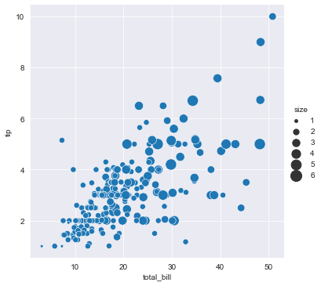
    


### catplot : 데이터 값이 카테고리화 되어 있을 때


```python
sns.set_style("whitegrid")
sns.catplot(x='day', y='total_bill',data=tips)
```


    <seaborn.axisgrid.FacetGrid at 0x7fbbe80f7a60>


    
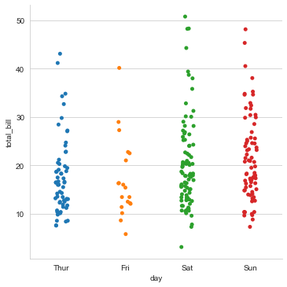
    


#### 데이터 출력 분포 방식을 조절하는 인자/속성

| agrument | attribute |
|--|--|
|jitter |False, True|
|kind|“strip”(default), “swarm”, “box”, “violin”, “boxen”, “point”, “bar”,  “count”|


```python
sns.catplot(x='day', y='total_bill',jitter=False, data=tips)
```


    <seaborn.axisgrid.FacetGrid at 0x7fbc0116a640>


    
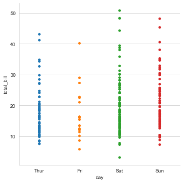
    


__catplot = figure-level function, 그림 전체를 반환하는 함수__   
__<-> axes-level function : axes에 그림을 그리는 함수__  
subplot으로 1) catplot(kind="violin"), 2) violinplot()을 그려서
두 plot이 동일한지 비교해보고 싶었다. 그런데 __오류 발생!__  


```python
fig, axes = plt.subplots(2,1, figsize=(8,5))
sns.violinplot(ax=axes[0], x='day',y='tip', data=tips)
sns.catplot(ax=axes[1], x='day', y='total_bill', label='catplot',kind='violin', data=tips)

# warning : catplot이 figure-level function 이라서 axes를 사용할 수 없다..?!
```

    /opt/anaconda3/lib/python3.8/site-packages/seaborn/categorical.py:3762: UserWarning: catplot is a figure-level function and does not accept target axes. You may wish to try violinplot
      warnings.warn(msg, UserWarning)


    <seaborn.axisgrid.FacetGrid at 0x7fbc23c9f0d0>


    
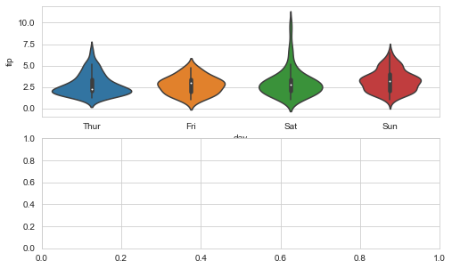
    


    
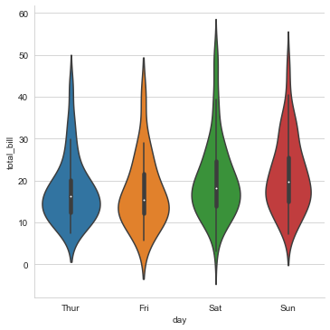
    


catplot은 plt을 쓰지 않아도 자기 스스로 전체 그림을 만든다.   
따라서 axes가 필요한 axes-level function인 violinplot이랑 catplot은 같이 사용할 수 없다.   
차라리 violin plot을 두 개 그리거나, catplot 2개 그려야한다.  
그래서 catplot은 ax란 인자가 없는 것 같다. catplot이 가지고 있는 kind 속성을 axes가 필요한 그래프로 그리려면 대체가능한 함수들이 있다. 아래는 목록 ↓ [링크](https://seaborn.pydata.org/generated/seaborn.catplot.html) [링크](https://jehyunlee.github.io/2020/10/06/Python-DS-36-seaborn_matplotlib3/)  


```python
# 대체 1. violinplot 2번쓰기
fig, axes = plt.subplots(2,1, figsize=(8,5))
sns.violinplot(ax=axes[0], x='day',y='total_bill', data=tips)
sns.violinplot(ax=axes[1], x='day',y='tip', data=tips)
# catplot 이 subplot을 하지 못하게 하는 원인이다!
```


    <AxesSubplot:xlabel='day', ylabel='tip'>


    
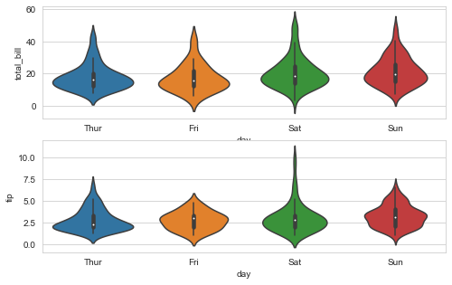
    


```python
sns.catplot(x='day',y='tip', kind='violin', data=tips, height=3)
sns.catplot(x='day', y='total_bill', label='catplot',kind='violin', data=tips, height=3)

```


    
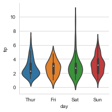
    


    
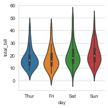
    


```python
# plt close를 쓰든 안쓰든 결과는 동일하다.
fig = plt.figure()

ax1 = fig.add_subplot(121)
g = sns.catplot(x='day',y='total_bill',kind='violin',data=tips,ax=ax1, height=3)

ax2 = fig.add_subplot(122)
g = sns.catplot(x='day',y='tip',kind='violin',data=tips,ax=ax2, height=3)

plt.close(0)
plt.close(1)
plt.tight_layout()
```

    /opt/anaconda3/lib/python3.8/site-packages/seaborn/categorical.py:3762: UserWarning: catplot is a figure-level function and does not accept target axes. You may wish to try violinplot
      warnings.warn(msg, UserWarning)
    /opt/anaconda3/lib/python3.8/site-packages/seaborn/categorical.py:3762: UserWarning: catplot is a figure-level function and does not accept target axes. You may wish to try violinplot
      warnings.warn(msg, UserWarning)


    

    


    
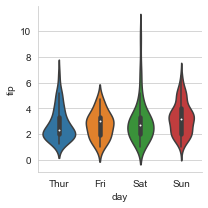
    


[링크](https://stackoverflow.com/questions/56788245/is-there-a-restriction-on-catplot-with-subplot)


```python
import seaborn as sns
import matplotlib.pyplot as plt

exercise = sns.load_dataset("exercise")

fig = plt.figure()

ax1 = fig.add_subplot(121)
g = sns.catplot(x="time", y="pulse", hue="kind", data=exercise, ax=ax1) # pass ax1

ax2 = fig.add_subplot(122)
g = sns.catplot(x="time", y="pulse", hue="kind", data=exercise, ax=ax2) # pass ax2

plt.close(0)
plt.close(1)
plt.tight_layout()
```

    /opt/anaconda3/lib/python3.8/site-packages/seaborn/categorical.py:3762: UserWarning: catplot is a figure-level function and does not accept target axes. You may wish to try stripplot
      warnings.warn(msg, UserWarning)
    /opt/anaconda3/lib/python3.8/site-packages/seaborn/categorical.py:3762: UserWarning: catplot is a figure-level function and does not accept target axes. You may wish to try stripplot
      warnings.warn(msg, UserWarning)


    
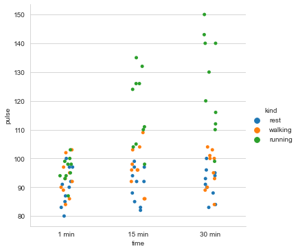
    


    
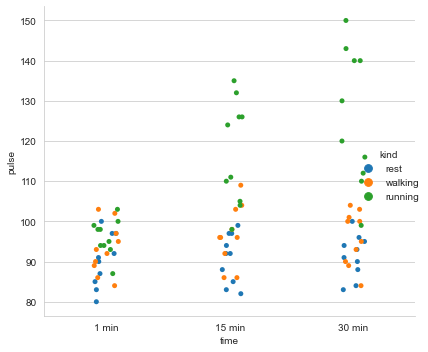
    


### <U>dataset 2. flights</U>
#### 수업 복습

### DataFrame.info( ) / DataFrame.describe( )


```python
fg = sns.load_dataset("flights")
# fg
fg.info() # 행과 열, 컬럼명, 자료형
# fg.describe() # 요약통계량
```

    <class 'pandas.core.frame.DataFrame'>
    RangeIndex: 144 entries, 0 to 143
    Data columns (total 3 columns):
     #   Column      Non-Null Count  Dtype   
    ---  ------      --------------  -----   
     0   year        144 non-null    int64   
     1   month       144 non-null    category
     2   passengers  144 non-null    int64   
    dtypes: category(1), int64(2)
    memory usage: 2.9 KB


### pivot 
- 테이블화


```python
fgpivot = fg.pivot("year","month","passengers")
fgpivot
```


<div>
<style scoped>
    .dataframe tbody tr th:only-of-type {
        vertical-align: middle;
    }

    .dataframe tbody tr th {
        vertical-align: top;
    }

    .dataframe thead th {
        text-align: right;
    }
</style>
<table border="1" class="dataframe">
  <thead>
    <tr style="text-align: right;">
      <th>month</th>
      <th>Jan</th>
      <th>Feb</th>
      <th>Mar</th>
      <th>Apr</th>
      <th>May</th>
      <th>Jun</th>
      <th>Jul</th>
      <th>Aug</th>
      <th>Sep</th>
      <th>Oct</th>
      <th>Nov</th>
      <th>Dec</th>
    </tr>
    <tr>
      <th>year</th>
      <th></th>
      <th></th>
      <th></th>
      <th></th>
      <th></th>
      <th></th>
      <th></th>
      <th></th>
      <th></th>
      <th></th>
      <th></th>
      <th></th>
    </tr>
  </thead>
  <tbody>
    <tr>
      <th>1949</th>
      <td>112</td>
      <td>118</td>
      <td>132</td>
      <td>129</td>
      <td>121</td>
      <td>135</td>
      <td>148</td>
      <td>148</td>
      <td>136</td>
      <td>119</td>
      <td>104</td>
      <td>118</td>
    </tr>
    <tr>
      <th>1950</th>
      <td>115</td>
      <td>126</td>
      <td>141</td>
      <td>135</td>
      <td>125</td>
      <td>149</td>
      <td>170</td>
      <td>170</td>
      <td>158</td>
      <td>133</td>
      <td>114</td>
      <td>140</td>
    </tr>
    <tr>
      <th>1951</th>
      <td>145</td>
      <td>150</td>
      <td>178</td>
      <td>163</td>
      <td>172</td>
      <td>178</td>
      <td>199</td>
      <td>199</td>
      <td>184</td>
      <td>162</td>
      <td>146</td>
      <td>166</td>
    </tr>
    <tr>
      <th>1952</th>
      <td>171</td>
      <td>180</td>
      <td>193</td>
      <td>181</td>
      <td>183</td>
      <td>218</td>
      <td>230</td>
      <td>242</td>
      <td>209</td>
      <td>191</td>
      <td>172</td>
      <td>194</td>
    </tr>
    <tr>
      <th>1953</th>
      <td>196</td>
      <td>196</td>
      <td>236</td>
      <td>235</td>
      <td>229</td>
      <td>243</td>
      <td>264</td>
      <td>272</td>
      <td>237</td>
      <td>211</td>
      <td>180</td>
      <td>201</td>
    </tr>
    <tr>
      <th>1954</th>
      <td>204</td>
      <td>188</td>
      <td>235</td>
      <td>227</td>
      <td>234</td>
      <td>264</td>
      <td>302</td>
      <td>293</td>
      <td>259</td>
      <td>229</td>
      <td>203</td>
      <td>229</td>
    </tr>
    <tr>
      <th>1955</th>
      <td>242</td>
      <td>233</td>
      <td>267</td>
      <td>269</td>
      <td>270</td>
      <td>315</td>
      <td>364</td>
      <td>347</td>
      <td>312</td>
      <td>274</td>
      <td>237</td>
      <td>278</td>
    </tr>
    <tr>
      <th>1956</th>
      <td>284</td>
      <td>277</td>
      <td>317</td>
      <td>313</td>
      <td>318</td>
      <td>374</td>
      <td>413</td>
      <td>405</td>
      <td>355</td>
      <td>306</td>
      <td>271</td>
      <td>306</td>
    </tr>
    <tr>
      <th>1957</th>
      <td>315</td>
      <td>301</td>
      <td>356</td>
      <td>348</td>
      <td>355</td>
      <td>422</td>
      <td>465</td>
      <td>467</td>
      <td>404</td>
      <td>347</td>
      <td>305</td>
      <td>336</td>
    </tr>
    <tr>
      <th>1958</th>
      <td>340</td>
      <td>318</td>
      <td>362</td>
      <td>348</td>
      <td>363</td>
      <td>435</td>
      <td>491</td>
      <td>505</td>
      <td>404</td>
      <td>359</td>
      <td>310</td>
      <td>337</td>
    </tr>
    <tr>
      <th>1959</th>
      <td>360</td>
      <td>342</td>
      <td>406</td>
      <td>396</td>
      <td>420</td>
      <td>472</td>
      <td>548</td>
      <td>559</td>
      <td>463</td>
      <td>407</td>
      <td>362</td>
      <td>405</td>
    </tr>
    <tr>
      <th>1960</th>
      <td>417</td>
      <td>391</td>
      <td>419</td>
      <td>461</td>
      <td>472</td>
      <td>535</td>
      <td>622</td>
      <td>606</td>
      <td>508</td>
      <td>461</td>
      <td>390</td>
      <td>432</td>
    </tr>
  </tbody>
</table>
</div>


```python
fgpivot = fg.pivot("month","year","passengers")
fgpivot
```


<div>
<style scoped>
    .dataframe tbody tr th:only-of-type {
        vertical-align: middle;
    }

    .dataframe tbody tr th {
        vertical-align: top;
    }

    .dataframe thead th {
        text-align: right;
    }
</style>
<table border="1" class="dataframe">
  <thead>
    <tr style="text-align: right;">
      <th>year</th>
      <th>1949</th>
      <th>1950</th>
      <th>1951</th>
      <th>1952</th>
      <th>1953</th>
      <th>1954</th>
      <th>1955</th>
      <th>1956</th>
      <th>1957</th>
      <th>1958</th>
      <th>1959</th>
      <th>1960</th>
    </tr>
    <tr>
      <th>month</th>
      <th></th>
      <th></th>
      <th></th>
      <th></th>
      <th></th>
      <th></th>
      <th></th>
      <th></th>
      <th></th>
      <th></th>
      <th></th>
      <th></th>
    </tr>
  </thead>
  <tbody>
    <tr>
      <th>Jan</th>
      <td>112</td>
      <td>115</td>
      <td>145</td>
      <td>171</td>
      <td>196</td>
      <td>204</td>
      <td>242</td>
      <td>284</td>
      <td>315</td>
      <td>340</td>
      <td>360</td>
      <td>417</td>
    </tr>
    <tr>
      <th>Feb</th>
      <td>118</td>
      <td>126</td>
      <td>150</td>
      <td>180</td>
      <td>196</td>
      <td>188</td>
      <td>233</td>
      <td>277</td>
      <td>301</td>
      <td>318</td>
      <td>342</td>
      <td>391</td>
    </tr>
    <tr>
      <th>Mar</th>
      <td>132</td>
      <td>141</td>
      <td>178</td>
      <td>193</td>
      <td>236</td>
      <td>235</td>
      <td>267</td>
      <td>317</td>
      <td>356</td>
      <td>362</td>
      <td>406</td>
      <td>419</td>
    </tr>
    <tr>
      <th>Apr</th>
      <td>129</td>
      <td>135</td>
      <td>163</td>
      <td>181</td>
      <td>235</td>
      <td>227</td>
      <td>269</td>
      <td>313</td>
      <td>348</td>
      <td>348</td>
      <td>396</td>
      <td>461</td>
    </tr>
    <tr>
      <th>May</th>
      <td>121</td>
      <td>125</td>
      <td>172</td>
      <td>183</td>
      <td>229</td>
      <td>234</td>
      <td>270</td>
      <td>318</td>
      <td>355</td>
      <td>363</td>
      <td>420</td>
      <td>472</td>
    </tr>
    <tr>
      <th>Jun</th>
      <td>135</td>
      <td>149</td>
      <td>178</td>
      <td>218</td>
      <td>243</td>
      <td>264</td>
      <td>315</td>
      <td>374</td>
      <td>422</td>
      <td>435</td>
      <td>472</td>
      <td>535</td>
    </tr>
    <tr>
      <th>Jul</th>
      <td>148</td>
      <td>170</td>
      <td>199</td>
      <td>230</td>
      <td>264</td>
      <td>302</td>
      <td>364</td>
      <td>413</td>
      <td>465</td>
      <td>491</td>
      <td>548</td>
      <td>622</td>
    </tr>
    <tr>
      <th>Aug</th>
      <td>148</td>
      <td>170</td>
      <td>199</td>
      <td>242</td>
      <td>272</td>
      <td>293</td>
      <td>347</td>
      <td>405</td>
      <td>467</td>
      <td>505</td>
      <td>559</td>
      <td>606</td>
    </tr>
    <tr>
      <th>Sep</th>
      <td>136</td>
      <td>158</td>
      <td>184</td>
      <td>209</td>
      <td>237</td>
      <td>259</td>
      <td>312</td>
      <td>355</td>
      <td>404</td>
      <td>404</td>
      <td>463</td>
      <td>508</td>
    </tr>
    <tr>
      <th>Oct</th>
      <td>119</td>
      <td>133</td>
      <td>162</td>
      <td>191</td>
      <td>211</td>
      <td>229</td>
      <td>274</td>
      <td>306</td>
      <td>347</td>
      <td>359</td>
      <td>407</td>
      <td>461</td>
    </tr>
    <tr>
      <th>Nov</th>
      <td>104</td>
      <td>114</td>
      <td>146</td>
      <td>172</td>
      <td>180</td>
      <td>203</td>
      <td>237</td>
      <td>271</td>
      <td>305</td>
      <td>310</td>
      <td>362</td>
      <td>390</td>
    </tr>
    <tr>
      <th>Dec</th>
      <td>118</td>
      <td>140</td>
      <td>166</td>
      <td>194</td>
      <td>201</td>
      <td>229</td>
      <td>278</td>
      <td>306</td>
      <td>336</td>
      <td>337</td>
      <td>405</td>
      <td>432</td>
    </tr>
  </tbody>
</table>
</div>


```python
plt.figure(figsize=(10,8))
sns.heatmap(fgpivot, annot=True, fmt="d") # annot:데이터값 주석처리, fmt:주석처리 formatting 
plt.show()
```


    
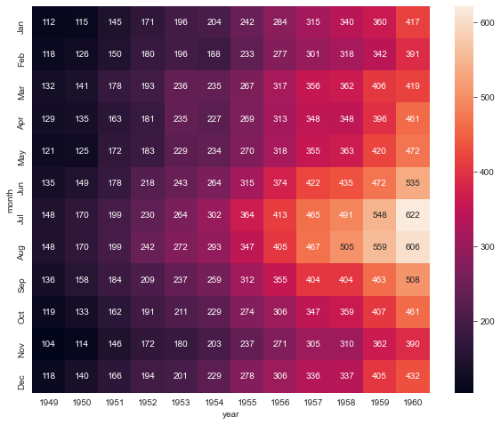
    


```python

```
