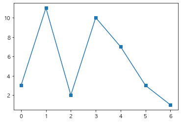
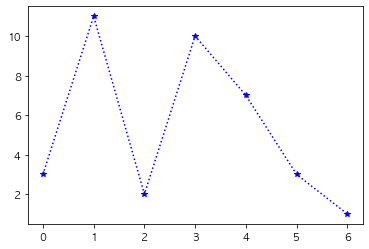
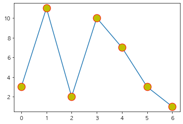
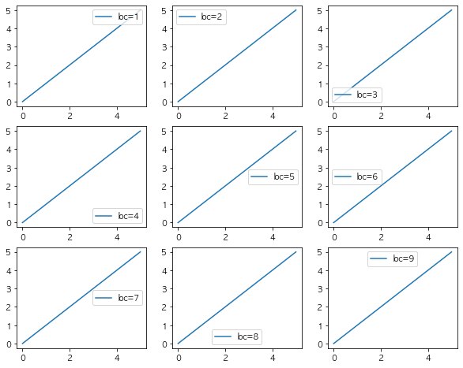
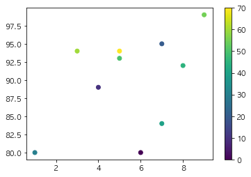
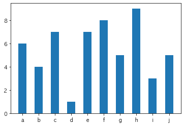
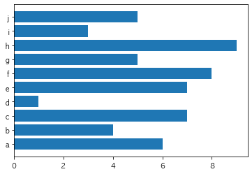
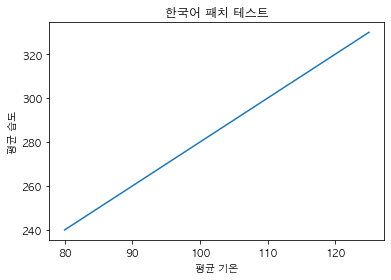

```python
from datetime import datetime
print("last update : ", datetime.today().strftime("%Y-%m-%d %H:%M"))
```

    last update :  2021-06-27 23:32


# matplotlib


```python
import matplotlib.pyplot as plt
import numpy as np
```


```python
y = np.array([3,11,2,10,7,3,1])
plt.plot(y, marker='s') # s:sqaure marker
```


    [<matplotlib.lines.Line2D at 0x7fd5b8a5b070>]


    

    


```python
plt.plot(y, ':*b')
```


    [<matplotlib.lines.Line2D at 0x7fd5a8974b80>]


    

    


```python
plt.plot(y, marker='o', ms=15, mec='r', mfc='y')
```


    [<matplotlib.lines.Line2D at 0x7fd5a88d5310>]


    

    


??? IPython.display와 PIL 이 뭔지 모르겠다...


```python
import IPython.display as display 
from PIL import Image

display.display(Image.open('./plt_legend_0627.png'))
```


    

    


#### 이미지 만들기  
loc 값의 위치에 따라 범례 위치 확인!


```python
x = np.array([0,1,2,3,4,5])
y = x.copy()

fig, axes = plt.subplots(3,3, figsize=(10,8))
n = 1
for i in range(3):
    for j in range(3):
        axes[i][j].plot(x,y, label=f'loc={n}')
        axes[i][j].legend(loc=n)
        n += 1
```


    

    


```python
# np.random.randint(low, high, size, dtype)
x = np.random.randint(10, size=10)
y = np.random.randint(80,100, size=10)
colors = np.array([0,10,20,30,40,45,50,55,60,70])
plt.scatter(x,y,c=colors, cmap='viridis')
plt.colorbar()
```


    <matplotlib.colorbar.Colorbar at 0x7fd5a904f1c0>


    

    


### bar plot


```python
cat = "a b c d e f g h i j" # 10개
y = cat.split(" ")
plt.bar(y,x, width=0.5) # width:막대기의 폭
```


    <BarContainer object of 10 artists>


    

    


```python
plt.barh(y,x)
```


    <BarContainer object of 10 artists>


    

    


### rc
- 한글 패치


```python
from matplotlib import font_manager, rc
import matplotlib.pyplot as plt
import platform
import matplotlib
```


```python
path = 'C:/Windows/Fonts/malgun.ttf'
print(platform.system())

if platform.system() == 'Windows':
    font_name = font_manager.FontProperties(fname=path).get_name()
    rc(font, family=font_name)
elif platform.system() == "Darwin":
    rc('font',family='AppleGothic')
else :
    print("Unknown System")
    
matplotlib.rcParams['axes.unicode_minus'] = False
    
```

    Darwin


한글 패치 테스트


```python
import numpy as np

x = np.array([80, 85, 90, 95, 100, 105, 110, 115, 120, 125])
y = np.array([240, 250, 260, 270, 280, 290, 300, 310, 320, 330])

plt.plot(x, y)
plt.title("한국어 패치 테스트") 
plt.xlabel("평균 기온") 
plt.ylabel("평균 습도")
```


    Text(0, 0.5, '평균 습도')


    

    


```python

```
