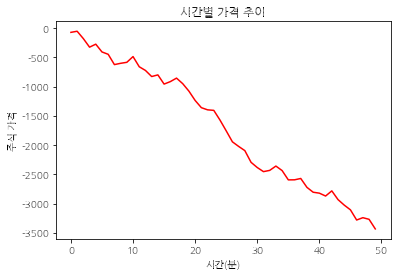
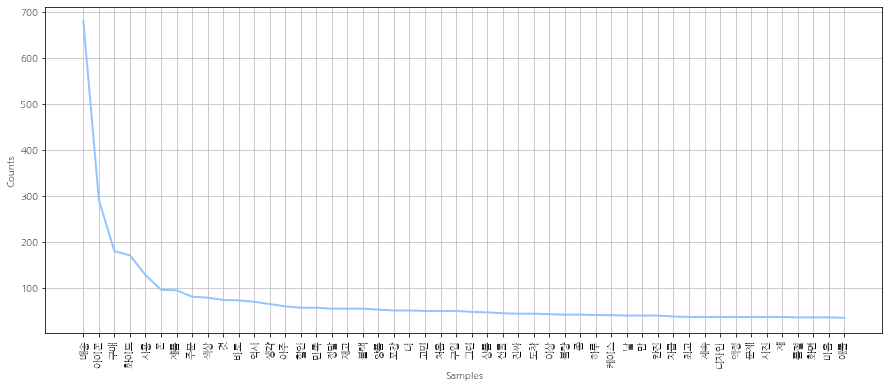
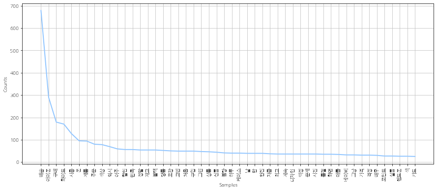
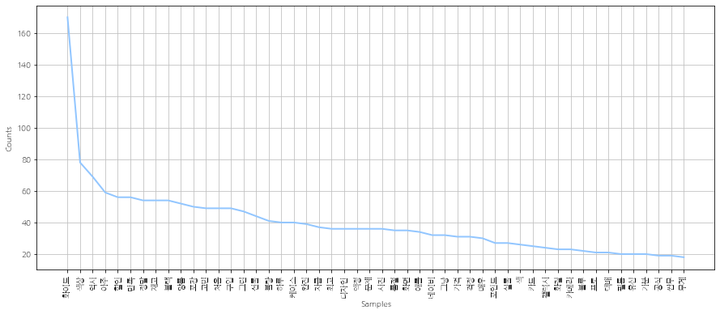

```python
%matplotlib inline
import matplotlib as mpl             # 기본 설정 만지는 용도
import matplotlib.pyplot as plt      # 그래프 그리는 용도
import matplotlib.font_manager as fm # 폰트 관련 용도
```


```python
### 나눔 고딕 설치  
!apt-get update -qq   # 설치를 업데이트   -qq  : 로그를 최소한으로
!apt-get install fonts-nanum* -qq # 설치한다. fonts-nanum*  
```


```python
path = '/usr/share/fonts/truetype/nanum/NanumGothicEco.ttf'  
font_name = fm.FontProperties(fname=path, size=10).get_name()
print(font_name)
plt.rc('font', family=font_name)

# 우선 fm._rebuild() 를 해주고 # 폰트 매니저 재빌드가 필요하다.
fm._rebuild()
```

    NanumGothic Eco


```python
%matplotlib inline
import matplotlib as mpl # 기본 설정 만지는 용도
import matplotlib.pyplot as plt # 그래프 그리는 용도
import matplotlib.font_manager as fm # 폰트 관련 용도
import numpy as np

path = '/usr/share/fonts/truetype/nanum/NanumGothicEco.ttf' # 설치된 나눔글꼴중 원하는 녀석의 전체
font_name = fm.FontProperties(fname=path, size=10).get_name()
print(font_name)
plt.rc('font', family=font_name)

## 음수 표시되도록 설정
mpl.rcParams['axes.unicode_minus'] = False 
```

    NanumGothic Eco


```python
# 데이터 준비
data = np.random.randint(-200, 100, 50).cumsum()
plt.plot(range(50), data, 'r')
plt.title('시간별 가격 추이')
plt.ylabel('주식 가격')
plt.xlabel('시간(분)')
plt.style.use('seaborn-pastel')
plt.show()
```


    

    


```python
 pip install konlpy
```

    Requirement already satisfied: konlpy in /usr/local/lib/python3.7/dist-packages (0.5.2)
    Requirement already satisfied: lxml>=4.1.0 in /usr/local/lib/python3.7/dist-packages (from konlpy) (4.2.6)
    Requirement already satisfied: JPype1>=0.7.0 in /usr/local/lib/python3.7/dist-packages (from konlpy) (1.3.0)
    Requirement already satisfied: tweepy>=3.7.0 in /usr/local/lib/python3.7/dist-packages (from konlpy) (3.10.0)
    Requirement already satisfied: colorama in /usr/local/lib/python3.7/dist-packages (from konlpy) (0.4.4)
    Requirement already satisfied: numpy>=1.6 in /usr/local/lib/python3.7/dist-packages (from konlpy) (1.19.5)
    Requirement already satisfied: beautifulsoup4==4.6.0 in /usr/local/lib/python3.7/dist-packages (from konlpy) (4.6.0)
    Requirement already satisfied: typing-extensions; python_version < "3.8" in /usr/local/lib/python3.7/dist-packages (from JPype1>=0.7.0->konlpy) (3.7.4.3)
    Requirement already satisfied: requests-oauthlib>=0.7.0 in /usr/local/lib/python3.7/dist-packages (from tweepy>=3.7.0->konlpy) (1.3.0)
    Requirement already satisfied: six>=1.10.0 in /usr/local/lib/python3.7/dist-packages (from tweepy>=3.7.0->konlpy) (1.15.0)
    Requirement already satisfied: requests[socks]>=2.11.1 in /usr/local/lib/python3.7/dist-packages (from tweepy>=3.7.0->konlpy) (2.23.0)
    Requirement already satisfied: oauthlib>=3.0.0 in /usr/local/lib/python3.7/dist-packages (from requests-oauthlib>=0.7.0->tweepy>=3.7.0->konlpy) (3.1.1)
    Requirement already satisfied: urllib3!=1.25.0,!=1.25.1,<1.26,>=1.21.1 in /usr/local/lib/python3.7/dist-packages (from requests[socks]>=2.11.1->tweepy>=3.7.0->konlpy) (1.24.3)
    Requirement already satisfied: idna<3,>=2.5 in /usr/local/lib/python3.7/dist-packages (from requests[socks]>=2.11.1->tweepy>=3.7.0->konlpy) (2.10)
    Requirement already satisfied: certifi>=2017.4.17 in /usr/local/lib/python3.7/dist-packages (from requests[socks]>=2.11.1->tweepy>=3.7.0->konlpy) (2021.5.30)
    Requirement already satisfied: chardet<4,>=3.0.2 in /usr/local/lib/python3.7/dist-packages (from requests[socks]>=2.11.1->tweepy>=3.7.0->konlpy) (3.0.4)
    Requirement already satisfied: PySocks!=1.5.7,>=1.5.6; extra == "socks" in /usr/local/lib/python3.7/dist-packages (from requests[socks]>=2.11.1->tweepy>=3.7.0->konlpy) (1.7.1)


# 애플 아이폰12의 리뷰 데이터 분석
- 데이터 출처 : 네이버 쇼핑 [링크](https://search.shopping.naver.com/catalog/24452875523?cat_id=50001519&frm=NVSCPRO&query=%EC%95%84%EC%9D%B4%ED%8F%B0+12&NaPm=ct%3Dkq6njw54%7Cci%3D7b6a2e5b639c0675d0d121738aa4829401f7c989%7Ctr%3Dsls%7Csn%3D95694%7Chk%3D99f7361259d7e4d400c0c8025811189308e0595f) 의 리뷰 1,527건 (2021.06.21 update)
- 데이터 셋 설명 
  - 파일명 : *iPhone_12.csv* 
  - user_id : 작성자 ID
  - score : 평점
  - date : 작성 일자
  - store : 구매 스토어
  - review_title : 리뷰 제목
  - review_contents : 리뷰 내용

- 프로그래밍에 필요한 파일
  - *iPhone_12.csv*
  - *stopwords_korean.txt*
  - *apple-logo.png*


## 1. 키워드 빈도수 분석
- 리뷰 제목만
- 한국어 엔진 Okt 사용
- 가장 많이 언급된 명사 순서대로 plot
  - 불용어 제거 전
  - 1차 불용어 제거 : *stopwords_korean.txt*으로부터
  - 2차 불용어 제거 : 내 주관적 판단으로 불필요한 단어 제거


```python
import nltk
from konlpy.tag import Okt
import pandas as pd
```


```python
data = pd.read_csv("iPhone_12.csv", index_col=0)
# data.head()
data.tail()
```


<div>
<style scoped>
    .dataframe tbody tr th:only-of-type {
        vertical-align: middle;
    }

    .dataframe tbody tr th {
        vertical-align: top;
    }

    .dataframe thead th {
        text-align: right;
    }
</style>
<table border="1" class="dataframe">
  <thead>
    <tr style="text-align: right;">
      <th></th>
      <th>user_id</th>
      <th>score</th>
      <th>date</th>
      <th>store</th>
      <th>review_title</th>
      <th>review_contents</th>
    </tr>
  </thead>
  <tbody>
    <tr>
      <th>1522</th>
      <td>r*g*****</td>
      <td>5</td>
      <td>20.10.30.</td>
      <td>하이마트쇼핑몰</td>
      <td>비싸지만 아이폰은 아이폰이네요</td>
      <td>비싸지만 아이폰은 아이폰이네요</td>
    </tr>
    <tr>
      <th>1523</th>
      <td>j*j*****</td>
      <td>5</td>
      <td>20.11.01.</td>
      <td>하이마트쇼핑몰</td>
      <td>배송도 빠르고 좋습니다. 감사합</td>
      <td>배송도 빠르고 좋습니다. 감사합니다.</td>
    </tr>
    <tr>
      <th>1524</th>
      <td>hbjy****</td>
      <td>5</td>
      <td>20.11.07.</td>
      <td>애플 공식 브랜드스토어</td>
      <td>좋아요좋아요!!!!</td>
      <td>좋아요좋아요!!!!</td>
    </tr>
    <tr>
      <th>1525</th>
      <td>qkqh****</td>
      <td>5</td>
      <td>20.10.31.</td>
      <td>애플 공식 브랜드스토어</td>
      <td>너무조아염 키득키득 배송칼배송</td>
      <td>너무조아염 키득키득 배송칼배송</td>
    </tr>
    <tr>
      <th>1526</th>
      <td>kimd****</td>
      <td>4</td>
      <td>20.11.09.</td>
      <td>애플 공식 브랜드스토어</td>
      <td>좋아유좋아유좋아유좋아유좋아유</td>
      <td>좋아유좋아유좋아유좋아유좋아유</td>
    </tr>
  </tbody>
</table>
</div>


```python
# text = "\n".join(data["review_title"]) # reviewtitle
text = "\n".join(data["review_contents"])
text[:1000]
```


    '화이트 사고 싶어서 품절 풀릴때 까지 하루에 한번씩 들어와서 확인했어요!!! 저는 5-6시 사이 오후시간대에 구매했습니다 여기서 구매한게 가장 합리적이고 만족스러워요 네이버페이 포인트가 이곳 저곳 유용하게 쓰이는데 포인트 많이 쌓이는게 제일 좋았어요bb배송도 하루만에 와서 빨리 받아 볼 수 있었어요!! 뽁뽁이로 싸져서 안전하게 배송됐어요 빠른배송 최고에요그리고 네이버 정식 애플사이트여서 믿고 구매했습니다!! 배송 오자마자 유투브 보면서 불량 확인 했는데 다행히 양품인것 같구요!!볼ㄸㅐ마다ㅠ영롱하고 너무 예뻐요 보고만있어도 흐뭇합니다 오래기다리다 구매해서 그런지 애틋하고 그러네요 ㅠㅠㅠxs쓰다가 넘어왔는데 가장 큰 차이점과 만족감은 일단 유투브 같은 영상의 화질이 너무 좋구요 그리고 무게도 너무 가벼워서 이전폰은 어떻게 썼나 싶네요!! 구매할때 강화필름 케이스 페키지가 품절이여서 같이 구매못한게 슬펐지만 예쁜 아이폰을 합리적이게 구매했다는 점에서 가장 만족스러워요!! 너~~~무 예쁩니다 꼭 사세요 두번 사세요 ㅠㅠㅠ\n포인트 받는거 까지 생각 하면 가격 괜찮게 구매 한것 같아요 배송도 다음날 바로 와서 걱정 없었고요  씨타입 케이블이라 충전기는 그전에 사용하던 케이블충전기를 계속 사용해야겠어요 ㅠ 이건 미리 알고 있던거라 ~~~ 그리고 생각보다 무겁지 않아요 디자인도 이쁘고 그립감도 좋어요화이트로 하길 잘한것 같아요 12프로랑 고민 했는데 12도 나쁘지 않는것 같습니다\n아이폰6를 사용하다. 19년초 맛챙이라 가서. 갤럭시 처음 써보고.생각 보다갤럭시가 괜찮있다가. 에스케이는. 쓰레기장은 내구성에 질렸습니다. 몇번떨궜더니 액정이나감. 이전. 아이폰4,6. 아무리떨궈도. 액정 나간적ㅇ없었는데. 마침 12 가 새로나왔다길래. 검정 흰색 사죄하고. 빨강 민트 파란 중 고민이많았습니다. 생각보다. 그린이. 남자랑. 잘맞네요. 여성. 여성하진않아요가격이너무비싸성망설여지고. 원래 핸드폰 욕심도없긴한데. 큰맘먹고 큰지출로 6년이상은버텨보갰습니다. 화면은 커졌는데 오타는 작렬하네'


```python
okt = Okt()
text_nouns = okt.nouns(text)
print(type(text_nouns))
print(len(text_nouns))
print(text_nouns[:10]) # 중복된 값이 존재
```

    <class 'list'>
    8633
    ['화이트', '사고', '품절', '때', '하루', '한번', '확인', '저', '사이', '오후']


```python
import nltk

ko = nltk.Text(text_nouns, name='review_title')
print(type(ko))
print(ko[:10])
print(ko.vocab().most_common(50))
```

    <class 'nltk.text.Text'>
    ['화이트', '사고', '품절', '때', '하루', '한번', '확인', '저', '사이', '오후']
    [('배송', 679), ('아이폰', 290), ('구매', 179), ('화이트', 170), ('사용', 127), ('폰', 95), ('제품', 94), ('주문', 80), ('색상', 78), ('것', 73), ('바로', 72), ('역시', 69), ('생각', 64), ('아주', 59), ('할인', 56), ('만족', 56), ('정말', 54), ('재고', 54), ('블랙', 54), ('양품', 52), ('포장', 50), ('더', 50), ('고민', 49), ('처음', 49), ('구입', 49), ('그린', 47), ('상품', 46), ('선물', 44), ('진짜', 43), ('도착', 43), ('이상', 42), ('불량', 41), ('좀', 41), ('하루', 40), ('케이스', 40), ('날', 39), ('맘', 39), ('완전', 39), ('자급', 37), ('최고', 36), ('계속', 36), ('디자인', 36), ('액정', 36), ('문제', 36), ('사진', 36), ('제', 36), ('품절', 35), ('화면', 35), ('마음', 35), ('애플', 34)]


```python
plt.figure(figsize=(15,6))
ko.plot(50)
plt.show()
```


    

    


### 1차 불용어 제거 
- 파일 *stopwords_korean.txt*로부터
- 한국어 불용어 사전


```python
stop_words = open("stopwords_korean.txt").read()
stop_words
```


    '아\n휴\n아이구\n아이쿠\n아이고\n어\n나\n우리\n저희\n따라\n의해\n을\n를\n에\n의\n가\n으로\n로\n에게\n뿐이다\n의거하여\n근거하여\n입각하여\n기준으로\n예하면\n예를 들면\n예를 들자면\n저\n소인\n소생\n저희\n지말고\n하지마\n하지마라\n다른\n물론\n또한\n그리고\n비길수 없다\n해서는 안된다\n뿐만 아니라\n만이 아니다\n만은 아니다\n막론하고\n관계없이\n그치지 않다\n그러나\n그런데\n하지만\n든간에\n논하지 않다\n따지지 않다\n설사\n비록\n더라도\n아니면\n만 못하다\n하는 편이 낫다\n불문하고\n향하여\n향해서\n향하다\n쪽으로\n틈타\n이용하여\n타다\n오르다\n제외하고\n이 외에\n이 밖에\n하여야\n비로소\n한다면 몰라도\n외에도\n이곳\n여기\n부터\n기점으로\n따라서\n할 생각이다\n하려고하다\n이리하여\n그리하여\n그렇게 함으로써\n하지만\n일때\n할때\n앞에서\n중에서\n보는데서\n으로써\n로써\n까지\n해야한다\n일것이다\n반드시\n할줄알다\n할수있다\n할수있어\n임에 틀림없다\n한다면\n등\n등등\n제\n겨우\n단지\n다만\n할뿐\n딩동\n댕그\n대해서\n대하여\n대하면\n훨씬\n얼마나\n얼마만큼\n얼마큼\n남짓\n여\n얼마간\n약간\n다소\n좀\n조금\n다수\n몇\n얼마\n지만\n하물며\n또한\n그러나\n그렇지만\n하지만\n이외에도\n대해 말하자면\n뿐이다\n다음에\n반대로\n반대로 말하자면\n이와 반대로\n바꾸어서 말하면\n바꾸어서 한다면\n만약\n그렇지않으면\n까악\n툭\n딱\n삐걱거리다\n보드득\n비걱거리다\n꽈당\n응당\n해야한다\n에 가서\n각\n각각\n여러분\n각종\n각자\n제각기\n하도록하다\n와\n과\n그러므로\n그래서\n고로\n한 까닭에\n하기 때문에\n거니와\n이지만\n대하여\n관하여\n관한\n과연\n실로\n아니나다를가\n생각한대로\n진짜로\n한적이있다\n하곤하였다\n하\n하하\n허허\n아하\n거바\n와\n오\n왜\n어째서\n무엇때문에\n어찌\n하겠는가\n무슨\n어디\n어느곳\n더군다나\n하물며\n더욱이는\n어느때\n언제\n야\n이봐\n어이\n여보시오\n흐흐\n흥\n휴\n헉헉\n헐떡헐떡\n영차\n여차\n어기여차\n끙끙\n아야\n앗\n아야\n콸콸\n졸졸\n좍좍\n뚝뚝\n주룩주룩\n솨\n우르르\n그래도\n또\n그리고\n바꾸어말하면\n바꾸어말하자면\n혹은\n혹시\n답다\n및\n그에 따르는\n때가 되어\n즉\n지든지\n설령\n가령\n하더라도\n할지라도\n일지라도\n지든지\n몇\n거의\n하마터면\n인젠\n이젠\n된바에야\n된이상\n만큼\t어찌됏든\n그위에\n게다가\n점에서 보아\n비추어 보아\n고려하면\n하게될것이다\n일것이다\n비교적\n좀\n보다더\n비하면\n시키다\n하게하다\n할만하다\n의해서\n연이서\n이어서\n잇따라\n뒤따라\n뒤이어\n결국\n의지하여\n기대여\n통하여\n자마자\n더욱더\n불구하고\n얼마든지\n마음대로\n주저하지 않고\n곧\n즉시\n바로\n당장\n하자마자\n밖에 안된다\n하면된다\n그래\n그렇지\n요컨대\n다시 말하자면\n바꿔 말하면\n즉\n구체적으로\n말하자면\n시작하여\n시초에\n이상\n허\n헉\n허걱\n바와같이\n해도좋다\n해도된다\n게다가\n더구나\n하물며\n와르르\n팍\n퍽\n펄렁\n동안\n이래\n하고있었다\n이었다\n에서\n로부터\n까지\n예하면\n했어요\n해요\n함께\n같이\n더불어\n마저\n마저도\n양자\n모두\n습니다\n가까스로\n하려고하다\n즈음하여\n다른\n다른 방면으로\n해봐요\n습니까\n했어요\n말할것도 없고\n무릎쓰고\n개의치않고\n하는것만 못하다\n하는것이 낫다\n매\n매번\n들\n모\n어느것\n어느\n로써\n갖고말하자면\n어디\n어느쪽\n어느것\n어느해\n어느 년도\n라 해도\n언젠가\n어떤것\n어느것\n저기\n저쪽\n저것\n그때\n그럼\n그러면\n요만한걸\n그래\n그때\n저것만큼\n그저\n이르기까지\n할 줄 안다\n할 힘이 있다\n너\n너희\n당신\n어찌\n설마\n차라리\n할지언정\n할지라도\n할망정\n할지언정\n구토하다\n게우다\n토하다\n메쓰겁다\n옆사람\n퉤\n쳇\n의거하여\n근거하여\n의해\n따라\n힘입어\n그\n다음\n버금\n두번째로\n기타\n첫번째로\n나머지는\n그중에서\n견지에서\n형식으로 쓰여\n입장에서\n위해서\n단지\n의해되다\n하도록시키다\n뿐만아니라\n반대로\n전후\n전자\n앞의것\n잠시\n잠깐\n하면서\n그렇지만\n다음에\n그러한즉\n그런즉\n남들\n아무거나\n어찌하든지\n같다\n비슷하다\n예컨대\n이럴정도로\n어떻게\n만약\n만일\n위에서 서술한바와같이\n인 듯하다\n하지 않는다면\n만약에\n무엇\n무슨\n어느\n어떤\n아래윗\n조차\n한데\n그럼에도 불구하고\n여전히\n심지어\n까지도\n조차도\n하지 않도록\n않기 위하여\n때\n시각\n무렵\n시간\n동안\n어때\n어떠한\n하여금\n네\n예\n우선\n누구\n누가 알겠는가\n아무도\n줄은모른다\n줄은 몰랏다\n하는 김에\n겸사겸사\n하는바\n그런 까닭에\n한 이유는\n그러니\n그러니까\n때문에\n그\n너희\n그들\n너희들\n타인\n것\n것들\n너\n위하여\n공동으로\n동시에\n하기 위하여\n어찌하여\n무엇때문에\n붕붕\n윙윙\n나\n우리\n엉엉\n휘익\n윙윙\n오호\n아하\n어쨋든\n만 못하다\t하기보다는\n차라리\n하는 편이 낫다\n흐흐\n놀라다\n상대적으로 말하자면\n마치\n아니라면\n쉿\n그렇지 않으면\n그렇지 않다면\n안 그러면\n아니었다면\n하든지\n아니면\n이라면\n좋아\n알았어\n하는것도\n그만이다\n어쩔수 없다\n하나\n일\n일반적으로\n일단\n한켠으로는\n오자마자\n이렇게되면\n이와같다면\n전부\n한마디\n한항목\n근거로\n하기에\n아울러\n하지 않도록\n않기 위해서\n이르기까지\n이 되다\n로 인하여\n까닭으로\n이유만으로\n이로 인하여\n그래서\n이 때문에\n그러므로\n그런 까닭에\n알 수 있다\n결론을 낼 수 있다\n으로 인하여\n있다\n어떤것\n관계가 있다\n관련이 있다\n연관되다\n어떤것들\n에 대해\n이리하여\n그리하여\n여부\n하기보다는\n하느니\n하면 할수록\n운운\n이러이러하다\n하구나\n하도다\n다시말하면\n다음으로\n에 있다\n에 달려 있다\n우리\n우리들\n오히려\n하기는한데\n어떻게\n어떻해\n어찌됏어\n어때\n어째서\n본대로\n자\n이\n이쪽\n여기\n이것\n이번\n이렇게말하자면\n이런\n이러한\n이와 같은\n요만큼\n요만한 것\n얼마 안 되는 것\n이만큼\n이 정도의\n이렇게 많은 것\n이와 같다\n이때\n이렇구나\n것과 같이\n끼익\n삐걱\n따위\n와 같은 사람들\n부류의 사람들\n왜냐하면\n중의하나\n오직\n오로지\n에 한하다\n하기만 하면\n도착하다\n까지 미치다\n도달하다\n정도에 이르다\n할 지경이다\n결과에 이르다\n관해서는\n여러분\n하고 있다\n한 후\n혼자\n자기\n자기집\n자신\n우에 종합한것과같이\n총적으로 보면\n총적으로 말하면\n총적으로\n대로 하다\n으로서\n참\n그만이다\n할 따름이다\n쿵\n탕탕\n쾅쾅\n둥둥\n봐\n봐라\n아이야\n아니\n와아\n응\n아이\n참나\n년\n월\n일\n령\n영\n일\n이\n삼\n사\n오\n육\n륙\n칠\n팔\n구\n이천육\n이천칠\n이천팔\n이천구\n하나\n둘\n셋\n넷\n다섯\n여섯\n일곱\n여덟\n아홉\n령\n영'


```python
ko_sw1 = [] # StopWords1
for one in ko:
  if one not in stop_words:
    ko_sw1.append(one)
```


```python
ko_sw1 = nltk.Text(ko_sw1, name='review_title_stopwords_1')
print(type(ko_sw1))
print(ko_sw1[:10])
print(ko_sw1.vocab().most_common(100))
```

    <class 'nltk.text.Text'>
    ['화이트', '사고', '품절', '하루', '한번', '확인', '사이', '오후', '시간대', '구매']
    [('배송', 679), ('아이폰', 290), ('구매', 179), ('화이트', 170), ('사용', 127), ('폰', 95), ('제품', 94), ('주문', 80), ('색상', 78), ('역시', 69), ('아주', 59), ('할인', 56), ('만족', 56), ('정말', 54), ('재고', 54), ('블랙', 54), ('양품', 52), ('포장', 50), ('고민', 49), ('처음', 49), ('구입', 49), ('그린', 47), ('상품', 46), ('선물', 44), ('불량', 41), ('하루', 40), ('케이스', 40), ('날', 39), ('맘', 39), ('완전', 39), ('자급', 37), ('최고', 36), ('계속', 36), ('디자인', 36), ('액정', 36), ('문제', 36), ('사진', 36), ('품절', 35), ('화면', 35), ('애플', 34), ('네이버', 32), ('그냥', 32), ('가격', 31), ('걱정', 31), ('매우', 30), ('포인트', 27), ('실물', 27), ('핸드폰', 26), ('색', 26), ('카드', 25), ('갤럭시', 24), ('확인', 23), ('보고', 23), ('화질', 23), ('카메라', 23), ('블루', 22), ('프로', 21), ('택배', 21), ('필름', 20), ('유심', 20), ('기분', 20), ('물건', 20), ('듭니', 20), ('공식', 19), ('쌈무', 19), ('무게', 18), ('상태', 18), ('빨', 18), ('레드', 18), ('색깔', 17), ('다행', 17), ('굿', 17), ('오후', 16), ('저녁', 16), ('결제', 16), ('이틀', 16), ('크기', 16), ('사서', 16), ('테스트', 15), ('오줌', 15), ('금요일', 15), ('하이마트', 15), ('미니', 14), ('박스', 14), ('뭐', 14), ('사전예약', 14), ('센터', 14), ('예약', 14), ('살짝', 13), ('선택', 13), ('서비스', 13), ('한번', 12), ('가장', 12), ('제일', 12), ('새로고침', 12), ('손', 12), ('발송', 12), ('속도', 12), ('기능', 12), ('성능', 12)]


```python
plt.figure(figsize=(15,6))
ko_sw1.plot(50)
plt.show()
```


    

    


### 2차 불용어 제거 
- `ko_sw1.vocab().most_common(100)` 중 의미가 없다고 판단되는 단어들을 제거
- 주관성 개입


```python
my_stop_words = "배송\n아이폰\n구매\n사용\n폰\n주문\n제품\n상품\n계속\n맘\n날\n핸드폰\n확인\n보고\n물건\n듭니\n사서\n뭐" 

ko_sw2 = []
for one in ko_sw1:
  if one not in my_stop_words:
    ko_sw2.append(one)

ko_sw2 = nltk.Text(ko_sw2, name='review_title_stopwords_2')
print(type(ko_sw2))
print(ko_sw2[:10])
print(ko_sw2.vocab().most_common(50))

plt.figure(figsize=(15,6))
ko_sw2.plot(50)
plt.show()
```

    <class 'nltk.text.Text'>
    ['화이트', '사고', '품절', '하루', '한번', '사이', '오후', '시간대', '가장', '합리']
    [('화이트', 170), ('색상', 78), ('역시', 69), ('아주', 59), ('할인', 56), ('만족', 56), ('정말', 54), ('재고', 54), ('블랙', 54), ('양품', 52), ('포장', 50), ('고민', 49), ('처음', 49), ('구입', 49), ('그린', 47), ('선물', 44), ('불량', 41), ('하루', 40), ('케이스', 40), ('완전', 39), ('자급', 37), ('최고', 36), ('디자인', 36), ('액정', 36), ('문제', 36), ('사진', 36), ('품절', 35), ('화면', 35), ('애플', 34), ('네이버', 32), ('그냥', 32), ('가격', 31), ('걱정', 31), ('매우', 30), ('포인트', 27), ('실물', 27), ('색', 26), ('카드', 25), ('갤럭시', 24), ('화질', 23), ('카메라', 23), ('블루', 22), ('프로', 21), ('택배', 21), ('필름', 20), ('유심', 20), ('기분', 20), ('공식', 19), ('쌈무', 19), ('무게', 18)]


    

    


## 2. 키워드 빈도수 시각화
- wordcloud 사용
- *apple-logo.png* 파일로 mask를 시도하였지만 잘안됨


```python
from wordcloud import WordCloud
from PIL import Image
```


```python
logo_mask = np.array(Image.open('Draw_car1.png'))
# logo_mask.shape # 4=rgba
logo_mask[3]
```


    (1024, 1024, 4)


```python
logo_mask = np.array(Image.open('apple-logo.png'))

for i in range(880):
    for j in range(820):
        for k in range(3):
          if logo_mask[i][j][k]==0:
            logo_mask[i][j][k] = 255

logo_mask[0]
```


    array([[248, 248, 248],
           [247, 247, 247],
           [247, 247, 247],
           ...,
           [247, 247, 247],
           [247, 247, 247],
           [247, 247, 247]], dtype=uint8)


```python
data = ko_sw2.vocab().most_common(1000)
data[:10]
```


    [('화이트', 170),
     ('색상', 78),
     ('역시', 69),
     ('아주', 59),
     ('할인', 56),
     ('만족', 56),
     ('정말', 54),
     ('재고', 54),
     ('블랙', 54),
     ('양품', 52)]


```python
wc = WordCloud(background_color='white', # 결과 이미지 배경색
               max_words=1000,
               mask=logo_mask,
               contour_width=2,
               contour_color='gray',
               font_path=path).generate_from_frequencies(dict(data))

plt.figure(figsize=(10,10))
plt.imshow(wc)
plt.axis("off")
plt.show()
```


    

    


```python

```
